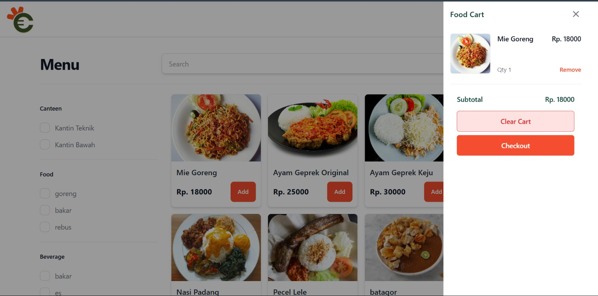
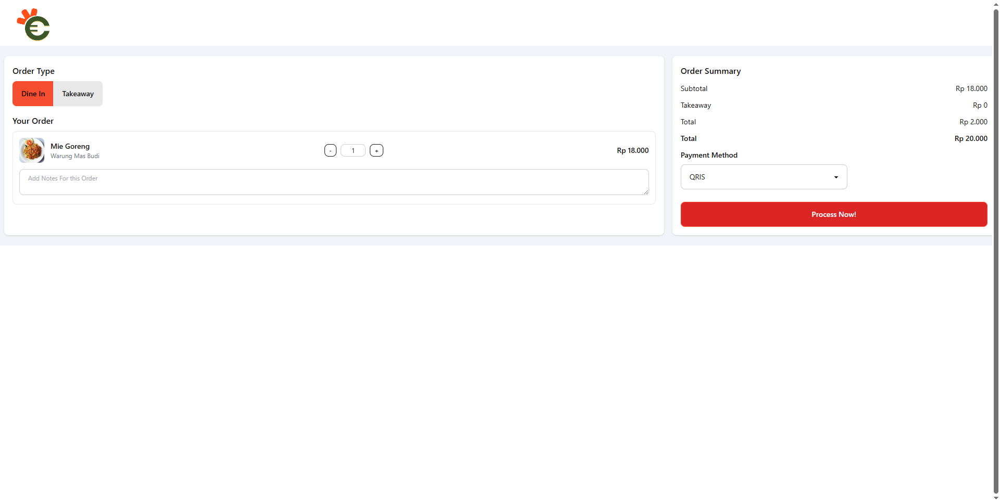
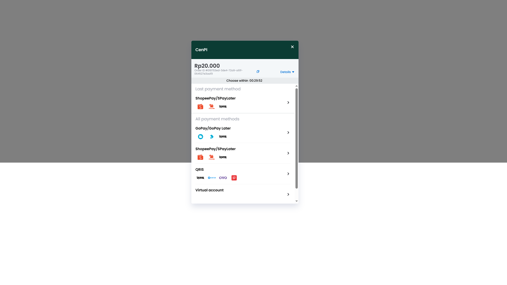
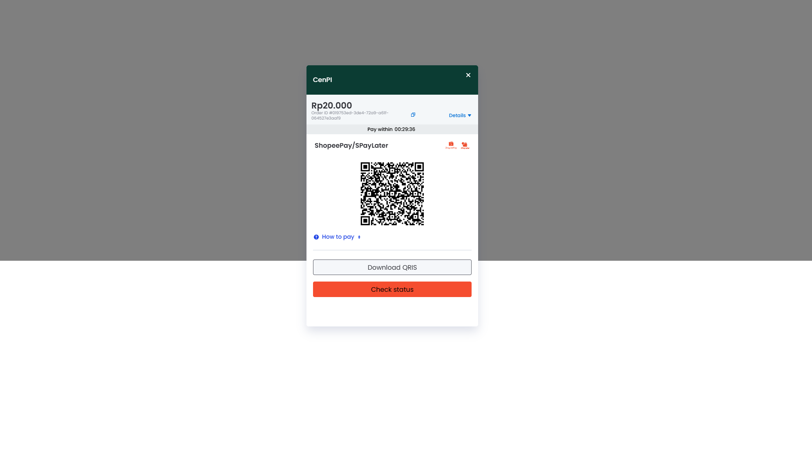
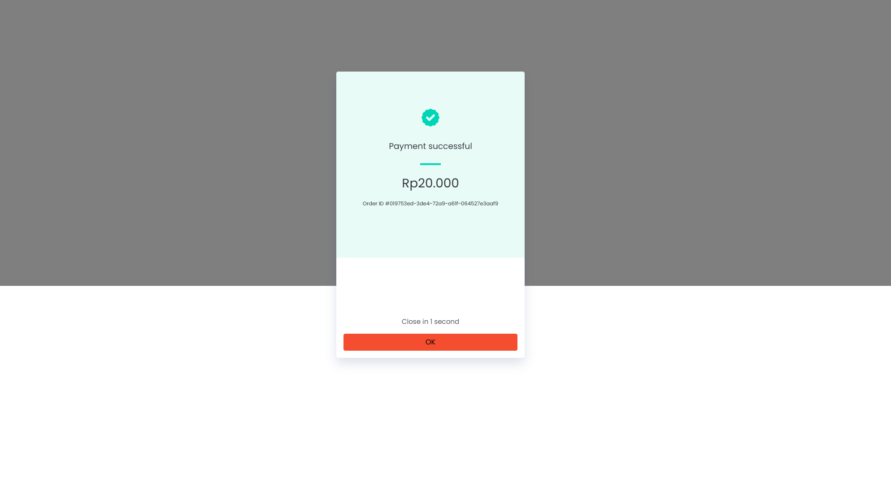
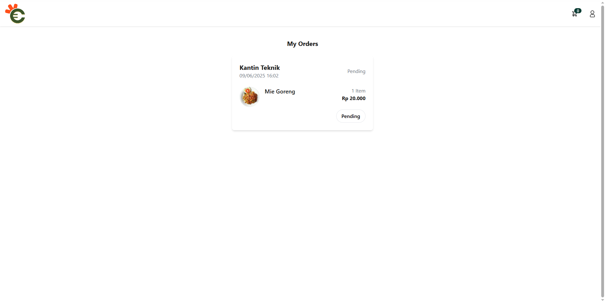
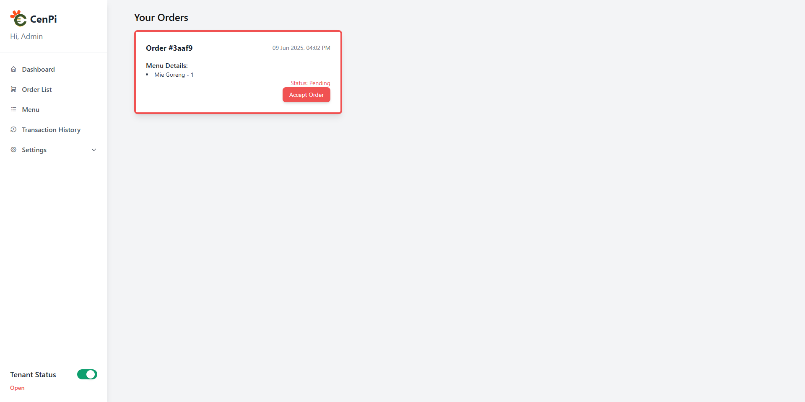
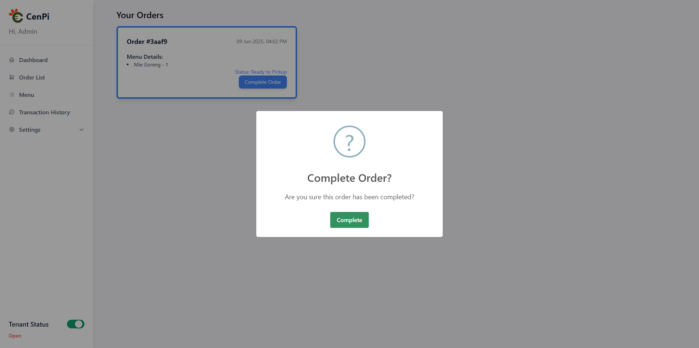
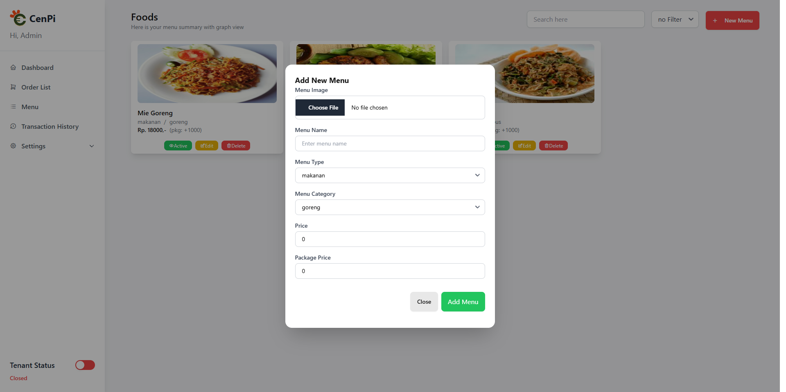

# 🍽️ CenPi - Central Canteen Payment Integration

## Description

**CenPi** adalah aplikasi web yang dikembangkan untuk mendigitalisasi sistem pemesanan makanan dan pembayaran di kantin kampus **Politeknik Negeri Jakarta**.  
Dengan CenPi, pengguna dapat memesan makanan secara online, melakukan pembayaran via QRIS, dan menghindari antrian panjang.

Aplikasi ini ditujukan untuk menciptakan ekosistem kantin yang lebih **efisien**, **cepat**, dan **terintegrasi**, serta meningkatkan kenyamanan bagi **mahasiswa, dosen, tenant, hingga pengelola kampus**.

---

## 📸 Documentation

<table>
  <tr>
    <td></td>
    <td></td>
    <td></td>
  </tr>
  <tr>
    <td></td>
    <td></td>
    <td></td>
  </tr>
  <tr>
    <td></td>
    <td></td>
    <td></td>
  </tr>
  <tr>
    <td></td>
  </tr>
</table>

---

## 🔧 Features

- ✅ Registrasi & Login (User / Tenant / Admin)
- ✅ Pemesanan menu makanan/minuman secara online
- ✅ Fitur **Cart** & Checkout
- ✅ Pembayaran terintegrasi dengan **QRIS (MidTrans)**
- ✅ Riwayat transaksi (user & tenant)
- ✅ CRUD Menu & Order Management untuk tenant
- ✅ Dashboard Analytics Penjualan untuk tenant
- ✅ Manajemen tenant & kategori oleh admin

---

## 💻 Tech Stack

- **Frontend**: HTML, CSS, JavaScript
- **Backend**: PHP (native)
- **Database**: Oracle SQL Developer
- **Security**: Token activation, Session Management
- **Payment**: MidTrans QRIS Integration

---
